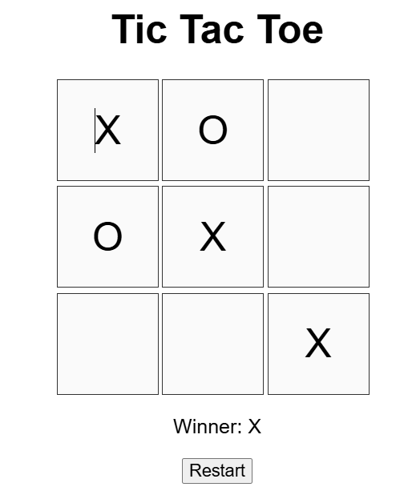

# Tic Tac Toe

A simple HTML, CSS, and JavaScript implementation of the classic Tic Tac Toe game.  
Players take turns clicking on the grid to place their X or O. The game announces the winner or a draw, and you can restart at any time.

## How to Play

1. Open `index.html` in your web browser.
2. Click on any empty square to make your move.
3. The game will display whose turn it is.
4. When a player wins or the game is a draw, a message will appear.
5. Click the **Restart** button to play again.

## Features

- Interactive 3x3 grid
- Displays current player's turn
- Detects win and draw conditions
- Restart button to reset the game

## Screenshot

## How it Works

- The game board is generated dynamically with JavaScript.
- Game logic checks for wins or draws after each move.
- The UI updates automatically after every move or reset.

---

Enjoy playing!